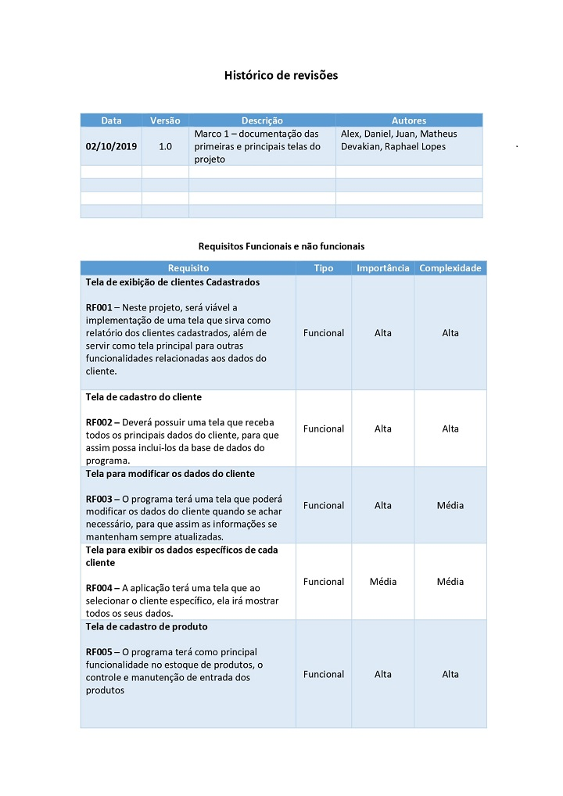
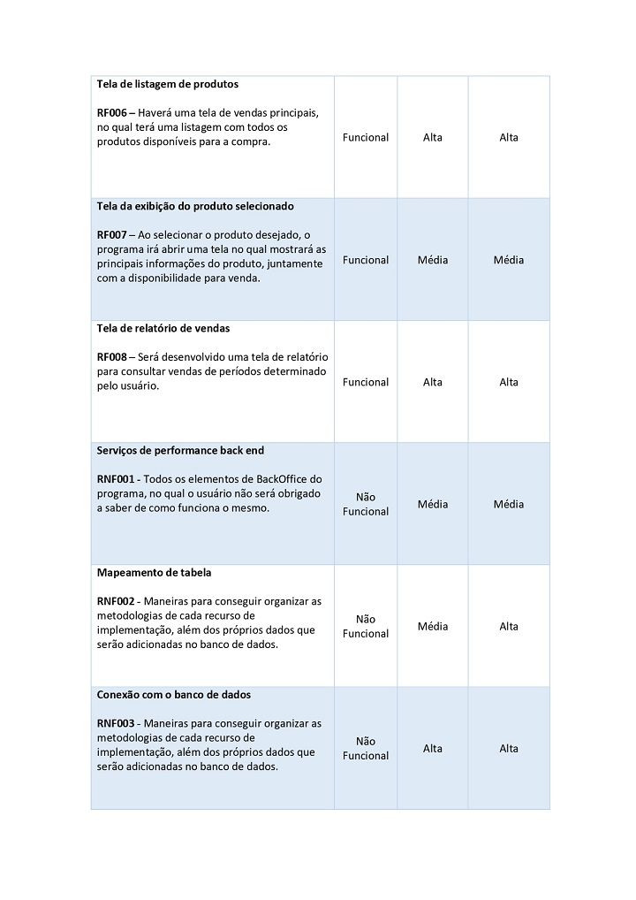
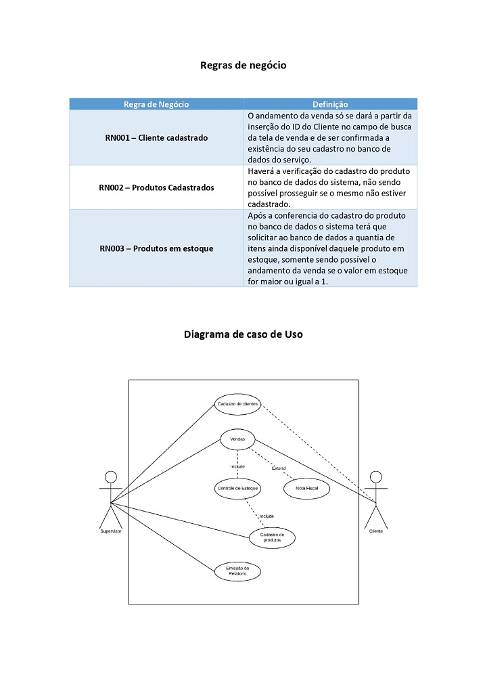
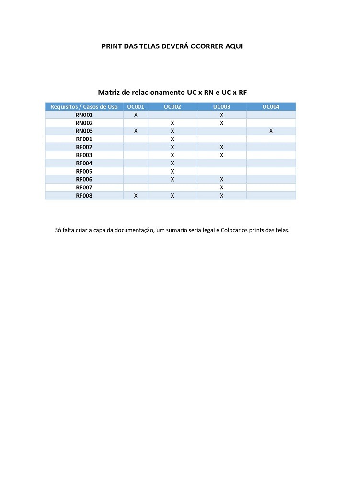

# Projeto-Integrador

## Intuito do projeto é fazer um sitemas de venda no modelo CRUD. 

### A data da entrega do primeiro macro esta marcada para 07.10.2019 sendo ele composto por:

#### 1º Esquemas de como sera as janelas
- [x] Cadastro de Cliente
- [x] Cadastro de Produto
- [x] Tela de Venda
- [x] Tela de Relatorio
- [x] Controle de Estoque

